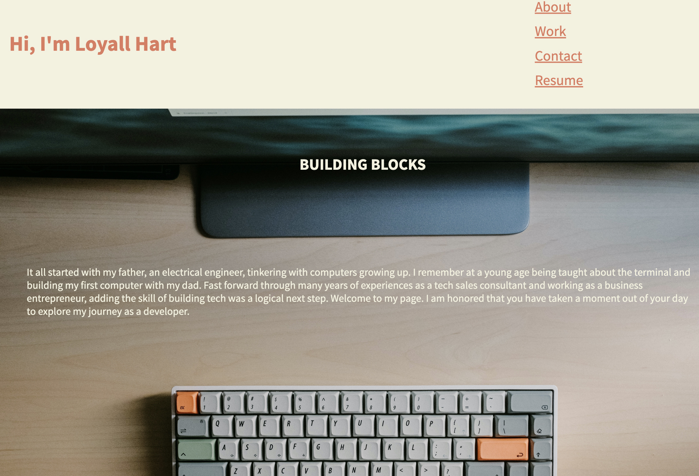

# My-Portfolio

## Description

### What was our motivation?

- An Employer is requesting a deployed portfolio of work samples. I will build a website that will display my portfolio in order to show that I am a good candidate for potential job opportunities. 

### Why did we build this project?

- I built this project to showcase my knowledge of HTML and CSS in web development. I also wanted a place to store and grow my portfolio of projects that showcase other technical skills that I develop. 

### What did we learn? 
- I learned how to make a responsive webpage from scratch. I learned a lot about transitioning images, the psuedo selector nth:child algebraic expression, when to use images in my html file vs my css file, and how to adjust the responsiveness of a page for different devices. 

## User Story

- AS AN employer
I WANT to view a potential employee's deployed portfolio of work samples
- SO THAT I can review samples of their work and assess whether they're a good candidate for an open position

## Acceptance Criteria

- GIVEN I need to sample a potential employee's previous work
- WHEN I load their portfolio
- THEN I am presented with the developer's name, a recent photo or avatar, and links to sections about them, their work, and how to contact them
- WHEN I click one of the links in the navigation
- THEN the UI scrolls to the corresponding section
- WHEN I click on the link to the section about their work
- THEN the UI scrolls to a section with titled images of the developer's applications
- WHEN I am presented with the developer's first application
- THEN that application's image should be larger in size than the others
- WHEN I click on the images of the applications
- THEN I am taken to that deployed application
- WHEN I resize the page or view the site on various screens and devices
- THEN I am presented with a responsive layout that adapts to my viewport

## Mock-Up

The following shows a sample of the web application's appearance:

## Deployment 

Deployed application can be found at https://loyallhart.github.io/My-Portfolio/
